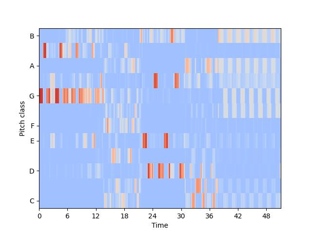
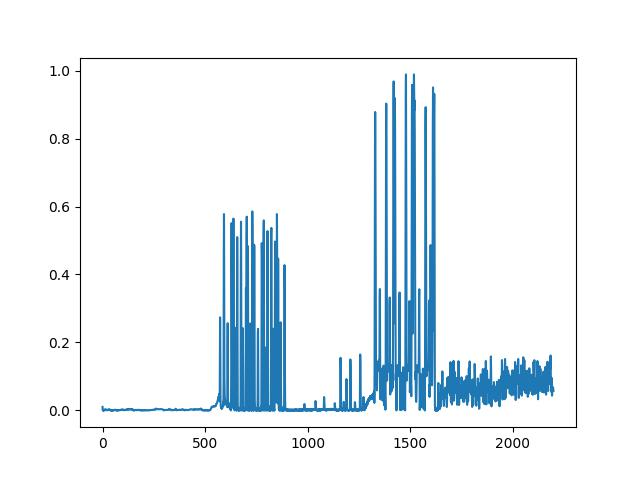
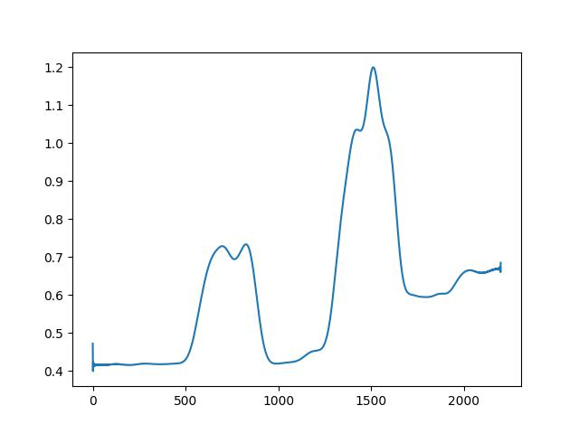
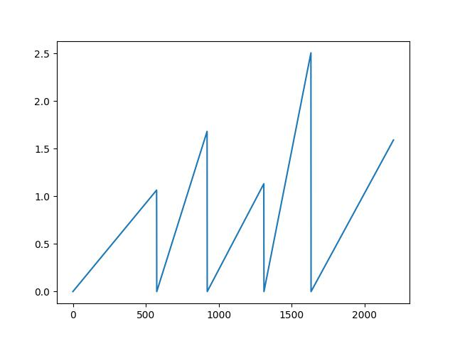
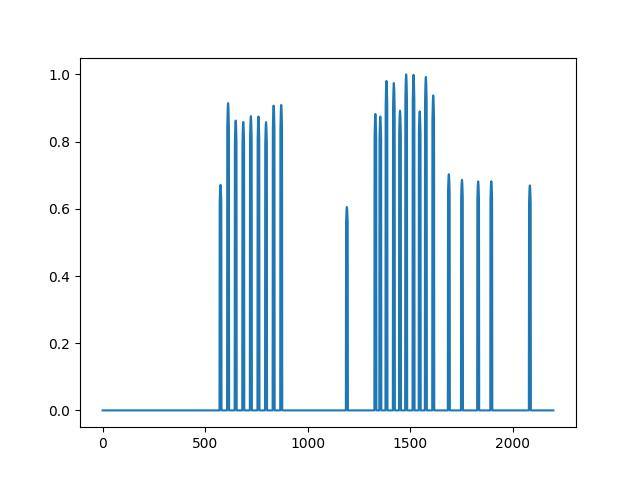
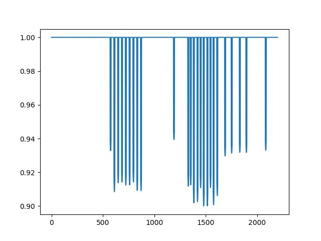
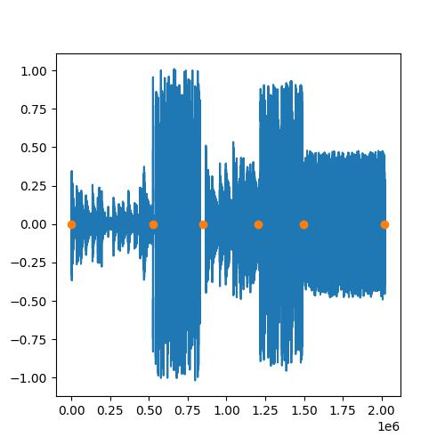

# AIART
This repo contains the code for my Film 499 visual art project seen [here](https://youtu.be/CnGdIXuR7QU).

UPDATE: I have made significant improvements to the AudioReactivity, the old README.md for reference is located in /src.

## Usage

[AIART.py](https://github.com/gmangonz/Personal/blob/main/AIART/AIART.ipynb) gives the process of how to train StyleGAN2 or run ```AudioReactive```, just make sure to change Parameters.py.

## How it works

To learn how StyleGAN2 works, it'll be best to look at the resources provided in References as those are the what helped me learn to implement this project from scratch. To get AudioReactive to work, I basically have to get the 3 inputs needed for StyleGAN2 that have dependencies on music signals. However one of the inputs is a 4x4 constant image, so I only have to get 2 inputs. These are obtained with ```.get_latents(...)``` and ```.get_noise(...)``` within ```AudioReacive```.

Now, what aspects of the music do I use? As a reference, some of these signals I extract from the audio are shown below.

- `self.audio_chroma`:


- `self.drums_rms`:


- `rms_signal_for_noise`:


- `sawtooth_signal`:


- drums onsets smoothed peaks (Used for network bending):


- drums onsets smoothed peaks plateud version (Used only for Zoom for network bending):


To set up the latents, I have to get them to a Tensor of shape (1, 8, 512) for the 8 blocks in my version of StyleGAN2. However that is to only make one image, so I actually have to get an array of (num_frames, 8, 512) where num_frames = duration * fps. The latents are dependent on 2 things: Tempo Segmentation and Chromagram/Decomposition of the audio. The tempo segmentation divides the audio into segments where the tempo changes. Chromagram/Decomposition of the audio produces 12 components which can be used to create weighted latents. 

### Tempo Segmentation

After running `tempo_segmentation()` within `Music_Processing.py`, I have different points indicating changes in tempo. These are seen by the yellow points in the following image.


Now, to make an array of (num_frames, 8, 512) I actually need to create an array of (num_frames, 1, 512). I do this by assigning each segment with a unique latent vector. However to avoid abrupt changes, I interpolate between latents whenever there is a change within ```.get_latents_from_impulse()``` using ```slerp()```. 

### Decomposition
Passing the audio into `decompose()` I obtain 12 compenents of the audio (this is significantly faster than `get_chroma()` and yields similar effects) which can be best explained [here](https://librosa.org/doc/main/generated/librosa.decompose.decompose.html). This gives an array of shape (num_frams, 12). If we take an array of 12 latent vectors i.e (12, 1, 512), reshape it to (12, 512), and perform matrix multiplication and reshape, we get (num_frams, 1, 512) which creates a sequence of weighted latents. 


### Make Input Latents
From Tempo Segmentation, we have (num_frames, 1, 512) and from Decomposition, we have (num_frams, 1, 512). However, the input required is (num_frames, 8, 512). Therefore, I tile each and stack them on top of each other to create latent vectors of shape (num_frames, 8, 512). How to tile and which to stack on top of which leads to different effects, however, as preference I like tiling the tempo segmentation output to (num_frames, 6, 512) and the decomposition to (num_frames, 2, 512) and stack the tempo segmentation output on top of the decomposition output. 

### Latent Modulation
The latents created above are the base latents. I also create another set of latent vectors of shape (num_frames, 8, 512). These latent vectors are created by tiling the decomposition ouputs to (num_frames, 2, 512) and the tempo segmentation outputs to (num_frames, 4, 512). Now to fill in the remaining 2 needed for a stack of 8, I run tempo segmentation again but with different seeds to create different vectors. These new outputs are tiled from (num_frames, 1, 512) to (num_frames, 2, 512) and are placed between the decomposition outputs and the original tempo segmentation outputs. From bottom to top these new latents come from decomposition (tiled by 2), tempo segmentation (new seeds tiled by 2) and tempo segmentation (original tiled by 4). Now, with 2 different sets of latent vectors, each of shape (num_frames, 8, 512), I can modulate between them with `drums_rms`.

### Noise
To create noise, I simply create 1 noise image of shape (res, res, 2) using a standard normal distrubution for each resolution in [4, 8, 16, 32, 64, 128, 256, 512] (i.e the input sizes to StyleGAN2). Now to create faux 3D noise I actually treat this noise image of 2 channels as 2-D vectors that I can rotate. So for each frame, take the noise and use `sawtooth_signal` to rotate the vectors and scale with `rms_signal_for_noise`. This scale essentially changes the standard normal standard deviation to sigma. Lower sigma = smoother noise. Higher sigma = sharper noise. The resulting rotated and scaled noise image is added along the channels to create an image of shape (res, res, 1) which is the appropriate input shape for StyleGAN2. Cheap fake 3D noise... :D

### Displacement Maps
Now, as an additional visual effect, I decided to implement displacement maps (term from Adobe After Affects) in the form of tfa.image.dense_image_warp. The input to tfa.image.dense_image_warp is an image of shape (Batch Size, Height, Width, Channels) and flow of shape (Batch Size, Height, Width, 2). The idea can be explained [here](https://www.tensorflow.org/addons/api_docs/python/tfa/image/dense_image_warp), but essentially, flow is used to displace pixels to new x-y positions (hence the need for 2 channels). 
Cheap fake perlin noise... :D

### Network Bending
Now the final part of the audio reactivity is to perform transformations at certain layers within the cascade of StyleGAN2 which can be trickled up to the final output. 


## TODO:

- [x] Tempo Segmentation fix.
- [x] Network Bending - Translation and Rotation fix.
- [x] Network Bending - Add more transformations.
- [ ] Research real time music component seperation.
- [x] Make ```self.get_noise()``` run in real time.
- [x] Create 3D faux noise.
- [x] Play with displacement maps and `tfa.image.dense_image_warp`
- [ ] Create my own dataset.
- [ ] Train model longer to get good images with any seed.
- [ ] StyleGAN3.
- [ ] 1024x1024 images.

# References

- https://github.com/dvschultz/ml-art-colabs
    - Inspired me to combine DL with Art
- https://github.com/christianversloot/machine-learning-articles/blob/main/stylegan-a-step-by-step-introduction.md
    - Where I first learned how StyleGAN works 
- https://cv-tricks.com/how-to/understanding-stylegan-for-image-generation-using-deep-learning/
    - Another StyleGAN resource
- https://github.com/beresandras/gan-flavours-keras
    - Helped in some aspects of my implementation of StyleGAN2
- https://github.com/NVlabs/stylegan2
    - Official StyleGAN2 implementation
- https://arxiv.org/pdf/1912.04958.pdf
    - Official StyleGAN2 paper
- https://nn.labml.ai/gan/stylegan/index.html
    - Helped me implement StyleGAN2
- https://github.com/JCBrouwer/maua-stylegan2
    - Inspired this project