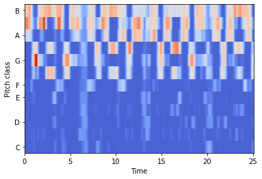
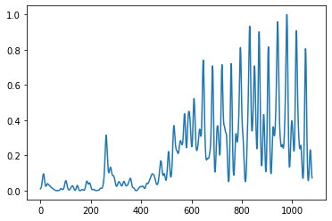
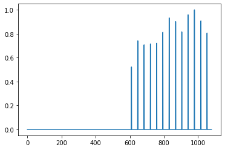
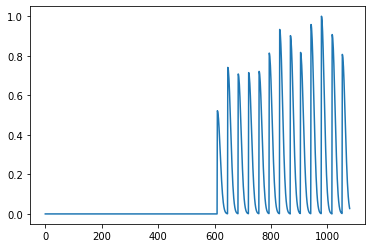
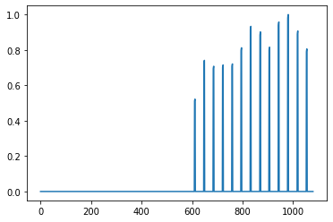
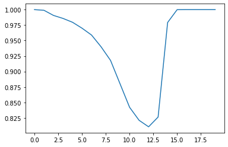
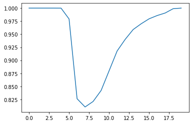

### How it Works

To learn how StyleGAN2 works, it'll be best to look at the resources provided in References. But to get AudioReactive to work, I basically have to get the 3 inputs needed for StyleGAN2 that have dependencies on music signals. However one of the inputs is a 4x4 constant image, so I only have to get 2 inputs. These are obtained with ```.get_latents(...)``` and ```.get_noise(...)``` within ```AudioReacive```. However ```.get_latents(...)``` calls various signals that come from ```Setup```. As a reference, some of these signals are shown below.

- setup.melody_chroma:


- setup.drums_onsetsHigh:


- setup.drums_onsetsHigh_peaks


- setup.drums_onsetsHigh_2 (right half of gaussians)


- setup.drums_onsetsHigh_2_r (left half of gaussians)


- setup.drums_onsetsHigh_2_r_p


To set up the latents, I have to get them to a Tensor of shape (1, 8, 512) for the 8 blocks in my version of StyleGAN2. However that is to only make one image, so I actually have to get an array of (num_frames, 1, 8, 512) where num_frames = duration * fps. 

As seen in ```.get_latents()``` I get the tempo latents and drum latents from the ```setup.tempo_segments``` and ```setup.NAME_peaks``` signals. Basically, everytime there is an impulse (new tempo or drum beat detected), a new latent seed is used. However to avoid abrupt changes, I transition between latents whenever there is a change in seeds used, this is taken care of by ```.get_latents_from_impulse()``` and ```.interpolate_latents()```. 

To complete ```.get_latents()``` I use the chromogram of the audio to get an array of weighted latents. I then tile the latents to get the desired input. 

After preparing the noise and gaussian noise, I wanted to have the effect that for every drum beat, have the image transition from smooth to a bit chaotic with noise and die back down to smooth. Therefore, I used ```setup.drums_onsetsMid_2``` and ```setup.drums_onsetsHigh_2```. When a beat hits, I get a 1 which means that in 

```weighted_noise = self.setup.drums_onsetsMid_2[..., None, None, None] * noise + (1-self.setup.drums_onsetsMid_2[..., None, None, None]) * gauss_noise```

the second term is 0 meaning all the noise comes from ```noise```. However as ```setup.drums_onsetsMid_2``` dies down to 0, the gaussian noise takes over again. Very subtle neat effect. 

To get the Network Bending to work, I had to create ```setup.NAME_2_r``` and ```setup.NAME_2_r_p```. The reason for this is that because in ```tf.keras.preprocessing.image.random_zoom(x_t, zoom_range=(mag, mag))``` if ```mag>1```, then the zoom is outwards - image becomes smaller, however I wanted to zoom in. Additionally, if ```mag==1``` then there is no effect, basically 1 is default. Therefore I needed to create a signal of 1's that had dips to values less than 1 to zoom in whenever there is a drum hit. To make it a nice subtle effect, I chose to keep the values in the range of 0.8-1. But why use ```setup.NAME_2_r```? As seen in line 160 in ```SetUp```, the math done means that something like 0.01 will turn to ~0.8 while 1 turns to 1. Therefore if I used ```setup.NAME_2``` (created with radius_2) to create ```setup.NAME_2_p``` then the dips would look like what is seen below.



This signal would lead to a slow** zoom in when the beat hits and a abrupt zoom back out. Which is not what I want.



However using ```setup.NAME_2_r```, I get an abrupt zoom in when as soon as the beat hits (the beat masks out the abruptness as audio can distract a viewer), and a slow** zoom out as the beat hit dies down, which is exacly what I want. 

Additionally, I decided to use a different radius_2 to make the effect suble but still noticable.

 ** Because of radius_2 this would actually be fast however to make my point it'll be an awkward Zoom effect if I used ```setup.NAME_2``` rather than ```setup.NAME_2_r```.
 
 That is basically how ```AudioReactive``` and ```Setup``` work to add music dependencies to the inputs of StyleGAN2. However, I did not mention ```.noise_transforms(...)``` within ```AudioReactive``` that is used in line 251. I honestly don't think it has any effect, I just kept it there. But line 251 can be changed to the following:
 
 ```bash
 noise_in = [noise_block[:, frame, :, :, :][:, None, :, :, :] for noise_block in noises]
 ```

## Things I learned:

Although an ambitious project, I'm glad I took it up and challenged myself. I think this is my first deep-learning project that "worked." Didn't achieve all my goals, but unlike previous projects, I actually achieved something that I can be happy and proud about. Nevertheless, I learned a lot in this project which I list below. 

- Tensorflow's ``` def build(self, input_shape): ``` came in handy. I can pass a tensor to a ```tf.keras.layers.Layer``` without knowing the shape of the input tensor and still run ``` def call(self, input): ``` as I can use ```build()``` to get the needed shape dependent inputs. 
    - As a note, I had quite a few errors within ```build()```. When creating a kernel:

    ```bash
    def build(self, input_shape):
        self.w = self.add_weight(...)
    ```
    I need to make sure to not do any operations with self.w within ```build()``` rather do it in ```def call()```.
    Example:
    ```bash
    def build(self, input_shape):
        self.w = self.add_weight(shape=[Kernel_Height, Kernel_Width, In Channels, Out Channels], initializer='zeros', trainable=True)
        self.w = self.w * scale
        super().build(input_shape)
    ```
    Should be: 
    ```bash
    def build(self, input_shape):
        self.w = self.add_weight(shape=[Kernel_Height, Kernel_Width, In Channels, Out Channels], initializer='zeros', trainable=True)
        self.scale = scale
    def call(self, input_tensor):
        self.w = self.w * self.scale
        # Continue
        super().build(input_shape)
    ```  
- ```tf.transpose```. I used this function a lot and learned how it works. 
```bash
tf.transpose(Tensor, [0, 1, 2]) # Does nothing
tf.transpose(Tensor, [1, 0, 2]) # Changes the position of the first and second axis (non-zero index). 
tf.transpose(Transposed_Tensor, [1, 0, 2]) # Would change back to original Tensor
```
- ```tf.reshape``` was also used extensively and got familiar with using -1 and with the fact the sum of the number of axes is preserved.
- ```tf.tile``` came in handy aswell. 
```bash
tf.tile(Tensor, [1, 8, 1]) # tiles the 2nd axis 8 times.
```
- How to add an axis:
    - ```array[:, np.newaxis, np.newaxis, :]```
    - ```array[:, None, None, :]```
    - ```tf.expand_dims(tf.expand_dims(array, 1), 2)```
    - ```array[..., None]``` adds new axis at the end
    - When selecting: ```array[[idx]]``` selects the idx'th element and preserves the axis
- summing axis 0 is "downwards"
- summing axis 1 is "horizonatally"
- I messed a little with ```model.weights``` and ```model.set_weights```.
- ```tf.Variable(0.0)``` and ```.assign(new_value)``` with ```def update(...)``` (ada) or ```def train_step(...)``` (StyleGAN2).
- Taking advantage of ```def train_step(...)``` within ```tf.keras.Model``` object.
    - Paired with:
        ```
        @property
        def metrics(self):
            return [self.discriminator_loss_metric, self.generator_loss_metric, self.real_accuracy, self.generated_accuracy, self.augmentation_probability_tracker]
        ``` 
        is quite neat. Allows to update the metrics displayed with ```.update_state(...)``` of a ```tf.keras.metrics``` object.
    - ```return {m.name: m.result() for m in self.metrics}```
- Cool little trick I experimented with:
    ```   
    def compile(self, steps_per_epoch, optimizer={}, metrics={}, *args, **kwargs):
        # Stuff
        super(StyleGAN2, self).compile(*args, **kwargs)
    ```
- ```super(Object, self).__init__(**kwargs)```
- To run ```model.summary()``` one needs to have ran ```.build()```, but to run ```.build()``` one needs ```def call(self, input)``` within a ```tf.keras.Model``` (I believe).


## Future Improvements:

### Seeds

Because the input latents (w's) of StyleGAN2 are created from random vectors mapped by the Mapping Network, I had to select seeds that allowed for replicability and selectability of the random vectors created. Therefore within Audioreactive.py, it took quite a bit of trial and error to choose the latent's seeds that gave a decent looking image. For the melody latents, because they are weighted with the chromagram (inspired by [JCBrouwer](https://github.com/JCBrouwer/maua-stylegan2/blob/7f9282141053be85ecb1ecc4a19f11bda90298b7/audioreactive/latent.py) and his [examples](https://github.com/JCBrouwer/maua-stylegan2/blob/7f9282141053be85ecb1ecc4a19f11bda90298b7/audioreactive/examples/default.py)) I can't add more than 12, rather I chose those that I liked. However for the drum and tempo latents, because the number of drum beats and different tempo segments can vary from audio to audio, I just chose those that gave an "artistic" image when tiled together [here](https://github.com/gmangonz/Personal/blob/main/AIART/src/Audioreactive.py) in line 189. However its quite apparent that this leads to repetitive images when rendered using a long audio segment. This is mostly because of the lack of versatility of the StyleGAN2 model I trained. Although there are thousands of images that can be rendered, after selecting those that I liked and those that, when tiled together, did not give a very blobby noisy image, I was left with those seen below. However, I would like to have it so that a random number is generated when a new seed is needed and have confidence that a good image will be generated using that seed. This ultimately means I would have to train the model for a longer amount of time and with a better, less sporadic dataset. Ideally a dataset that I create myself so that I can have some say in the output rather than rely on [WikiArt](https://www.wikiart.org/en/paintings-by-genre). However that would be a project on its own and probably not achievable anytime soon with my lack of GPU resources, money, and time now that I have graduate school.

```bash
# Set seeds
self.melody_latents_seeds = [388, 51, 97, 251, 389, 447, 185, 35, 166, 8, 21, 39]
self.drum_latents_seeds = [1, 39, 51, 97, 125, 166, 232, 251, 196, 320, 389]
self.tempo_latents_seeds = [51, 139, 491, 93, 39, 186, 76] 

```
### StyleGAN2 Model

In addition to what I mentioned above, I would also like to implement my own upsample and downsample and maybe try looking into StyleGAN3. Additionally with better GPU resources, training a model to achieve highly abstract and realistic 1024x1024 (or maybe even 2048x2048) images would be ideal. This would remove the need for tensorflow's super-resolution within Audioreacive.py and the color grading that came after.

### Tempo Segmentation
Within Setup.py, I cheated and manually selected the times that I felt had a shift in tempo after listening to the audio. Therefore I actually did not use the ruptures package because during testing, when trying to run the 451 second long audio, it kept running for a couple hours. However, I would like to implement a system that could do this fast and effectively.

```bash

def tempo_segmentation():

    """
    Using the ruptures package, segment the audio with timestamps where there are tempo changes (predicted).
    Adjust so that the timestamps match the desired number of frames.
    Add 0 at start and make last timeframe equal num_frames-1.

    """
    # return np.array([0, 590, 719])
    # return np.array([0, 590, 912, 1320, 1632, 2159])
    return np.array([0, 592, 1188, 1776, 2368, 2952, 3552, 4142, 4183, 4238, 4232, 4335, 4377, 4432, 4473, 4526, 4928, 5289, 6152, 6201, 6253, 6297, 6350, 6393, 6446, 7272, 7600, 7840, 7904, 8496, 8581, 9202, 9800, 10432, 10668, 10824])
    
    # Ruptures code is below but because I returned above, this does not do anything #
      
```
### Network Bending

As of now, I only have Zoom implemented in Audioreactive.py in line 255.
```bash
# Network Bending: Zoom, Translation, Rotation
transformation_dict = {'generator__block_6': [ Zoom(), self.setup.drums_onsetsMid_2_r_p[frame] ], 'generator__block_3': [ Zoom(), self.setup.bass_onsetsHigh_2_r_p[frame] ]}
```
However, I would like to also implement Translation and Rotation into Audioreactive.py. Unfortunately because some of the functions weren't working, I only focused on getting Zoom to work with Audioreactive and therefore left Translation and Rotation in the dark. But now that I know how I got Zoom to work, I think getting Translation and Rotation to work would involve making the similar changes I made to Zoom (I think it was to use the ```tf.keras.preprocessing.image``` package rather than the ```tf.keras.layers``` that was the fix).

```bash

class Translation(layers.Layer): ############## MAKE CHANGES to match zoom_range=(mag, mag)

  def __init__(self):

    super(Translation, self).__init__()
    self.trainable=False

  def call(self, input):

    x, mag = input
    x_t = tf.transpose(x[0], [2, 0, 1]) # (1, H, W, C) -> (C, H, W)
    x_t_shift = tf.keras.preprocessing.image.random_shift(x_t, mag, mag)
    return tf.transpose(x_t_shift, [1, 2, 0])[None, ...] # (C, H, W) -> (1, H, W, C)
    # factor = (tf.cast(tf.math.minimum(mag, 0.95), tf.float64), tf.cast(tf.math.minimum((mag + 0.2*mag), 1), tf.float64))
    # return tf.keras.layers.RandomTranslation(height_factor=factor, width_factor=factor)(x)

class Rotation(layers.Layer): ############## MAKE CHANGES to match zoom_range=(mag, mag)

  def __init__(self):

    super(Rotation, self).__init__()
    self.trainable=False

  def call(self, input):

    x, mag = input

    augmentation_values = tf.random.uniform(shape=(1,), minval=0.0, maxval=1.0) # Generate random number
    pos_or_neg = tf.where(tf.math.less(augmentation_values, mag) , -1, 1).numpy()[0]
    if pos_or_neg == 1:
      factor = (tf.cast(tf.math.minimum(mag, 0.95), tf.float64), tf.cast(tf.math.minimum((mag + 0.2*mag), 1), tf.float64))
    else:
      factor = (tf.cast(tf.math.maximum(-(mag + 0.2*mag), -1), tf.float64), tf.cast(tf.math.maximum(-mag, -0.95), tf.float64))

    x_t = tf.transpose(x[0], [2, 0, 1]) # (1, H, W, C) -> (C, H, W)
    x_t_rotation = tf.keras.preprocessing.image.random_rotation(x_t, factor)
    return tf.transpose(x_t_rotation, [1, 2, 0])[None, ...] # (C, H, W) -> (1, H, W, C)
    return tf.keras.layers.RandomRotation(factor=factor)(x)

```
Additionally, right now I have ```transformation_dict = {'generator__block_6': [ Zoom(), self.setup.drums_onsetsMid_2_r_p[frame] ], 'generator__block_3': [ Zoom(), self.setup.bass_onsetsHigh_2_r_p[frame] ]}```, inside ```AudioReactive.generate_video(...)```, however, I would like this dictionary be a parameter that can be passed to ```.generate_video(...)``` so that I can change the layers that are affected and which effects to use. 


### Real Time implementation

My most ambitious goal when approaching this project was to make it real-time so that I could use a camera during showcase and have input coming from the participants as they would interact with the camera. With their input, they could affect the image that is produced either with facial features or through motion detection. However to achieve this, I would first need to get Audioreactive to run in real-time. This is something that I would need to figure out and test as both ```Setup``` and ```get_noise()``` within Setup.py make it so the whole system is offline and needs the audio/music beforehand. Dealing with ```Setup``` will probably involve using shifting windows of maybe 100ms that take the current input and the previous 100ms of audio and generate the corresponding signals seen within ```Setup```. However, even though I think this would work, because there are quite a few signals needed to be returned, I'm not sure how real-time this could get. Therefore, I think I would need to implement ```Setup``` with [tf.signal](https://www.tensorflow.org/api_docs/python/tf/signal) to take advantage of a GPU and maybe research real-time music component seperation to fully achieve ```Setup``` in real-time. The challenge will involve ```get_noise()```. Within ```get_noise()``` I filter spatially, however this is a bit slow for a sequence of high-resolution images and therefore could hinder real time performance. I would have to look into implementing gaussian filtering within [tensorflow](https://www.tensorflow.org/addons/api_docs/python/tfa/image/gaussian_filter2d). Spatially filtering will be a little tricky as I would have to store previous N noises created and use them to spatially filter the current image, or come up with something different. 

### Summary - TODO:

- [ ] Make custom upsample and downsample function.
- [ ] Tempo Segmentation fix.
- [ ] Network Bending - Translation and Rotation fix.
- [ ] Implement ```Setup``` with ```tf.signal```.
- [ ] Research real time music component seperation.
- [ ] Make ```get_noise()``` run in real time.
- [ ] Create my own dataset.
- [ ] Train model longer to get good images with any seed.
- [ ] StyleGAN3.
- [ ] 1024x1024 images.

# References

- https://github.com/dvschultz/ml-art-colabs
    - Inspired me to combine DL with Art
- https://github.com/christianversloot/machine-learning-articles/blob/main/stylegan-a-step-by-step-introduction.md
    - Where I first learned how StyleGAN works 
- https://cv-tricks.com/how-to/understanding-stylegan-for-image-generation-using-deep-learning/
    - Another StyleGAN resource
- https://github.com/beresandras/gan-flavours-keras
    - Helped in some aspects of my implementation of StyleGAN2
- https://github.com/NVlabs/stylegan2
    - Official StyleGAN2 implementation
- https://arxiv.org/pdf/1912.04958.pdf
    - Official StyleGAN2 paper
- https://nn.labml.ai/gan/stylegan/index.html
    - Helped me implement StyleGAN2
- https://github.com/JCBrouwer/maua-stylegan2
    - Inspired this project

###

This was a project I took on with little cs background therefore it lacks in its usability.

